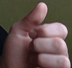
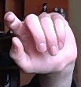

# Real-Time Gesture Recognition for Human-Computer Interaction

This repository contains a real-time hand gesture recognition pipeline designed for human-computer interaction. It utilizes Google's MediaPipe for spatial hand landmark extraction and a PyTorch-based Long Short-Term Memory (LSTM) neural network to classify temporal sequences of those landmarks.

## 📁 Project Structure

* **`data/`**: Directory containing recorded landmark sequences used for training the model.
* **`record_gestures.py`**: A utility script to capture webcam video, extract MediaPipe hand landmarks, and save the temporal sequences to the `data/` directory for dataset generation.
* **`train.ipynb`**: A Jupyter Notebook containing the data loading, preprocessing, and training loop for the PyTorch LSTM model.
* **`gesture_lstm.pth`**: The trained PyTorch model weights.
* **`hand_landmarker.task`**: The official MediaPipe Hand Landmarker model used for base landmark detection.
* **`prototype_lstm.py`**: The primary real-time inference script. It captures webcam feed, extracts sequences of landmarks, feeds them to the LSTM, and displays stabilized predictions (requires $\ge$ 90% confidence over 3 consecutive frames to mitigate flickering).
* **`mediapipe_test.py`**: A basic script to verify that the MediaPipe hand tracking environment is working correctly without the ML model attached.
* **`gesture_recognition_custom.py`** & **`custom_model_mediapipeapi.task`**: Scripts and task files for an alternative/custom model deployment using MediaPipe's native custom task API.

## ✨ Key Features

* **Temporal Sequence Modeling**: Uses an LSTM to understand the *movement* and *sequence* of a gesture over time, rather than just static frame-by-frame poses.
* **Prediction Stabilization**: Implements a confidence threshold mechanism requiring sustained model certainty before locking in a gesture, significantly reducing false positives during hand transitions.
* **End-to-End Pipeline**: Includes tools for custom dataset creation, model training, and real-time deployment.

## 👋 Supported Gestures

Below is the list of gestures trained for this project, along with their mapped actions and status. 

| ID | Gesture | Action / Status | Demonstration |
| :---: | :--- | :--- | :---: |
| **1** | To the right | Next slide |  |
| **2** | To the left | Previous slide |  |
| **3** | Hand down | *(Not in use now)* |  |
| **4** | Rotate | *(Not in use now)* |  |
| **5** | OK | *(Not in use)* |  |
| **6** | Slide to the right | |  |
| **7** | Slide to the left | |  |
| **8** | To me, closer | |  |
| **9** | Scale up | |  |


## 🚀 Getting Started

### Prerequisites

Ensure you have Python installed along with the following primary dependencies:

pip install -r requirements.txt

### Workflow

1.  **Collect Data**: Run `record_gestures.py` to record your own custom hand gestures. Follow the on-screen prompts to capture multiple sequences per class.
2.  **Train Model**: Open `train.ipynb`, point it to your generated `data/` folder, and run the cells to train the `GestureLSTM` network. The notebook will output the `gesture_lstm.pth` weights file.
3.  **Run Inference**: Execute `prototype_lstm.py` to test your trained model in real-time using your webcam.

```bash
python prototype_lstm.py